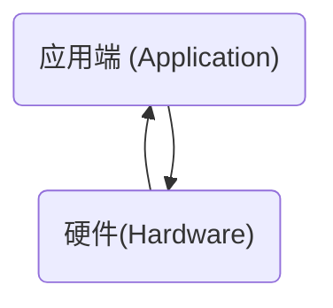
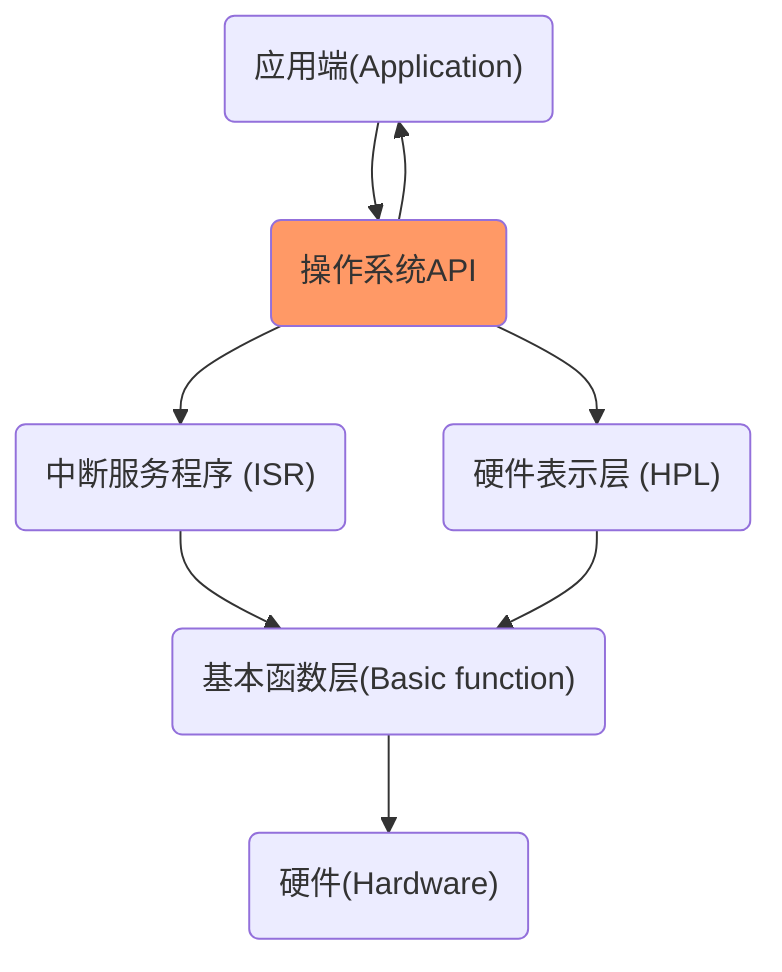
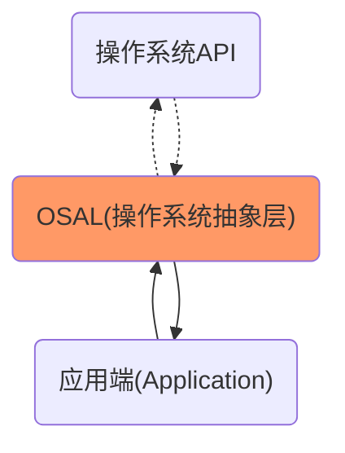
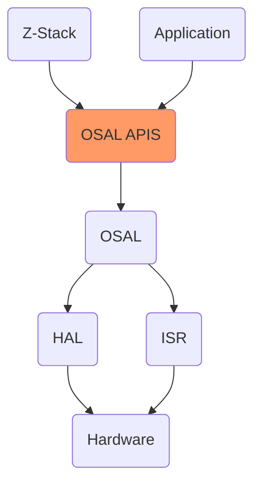
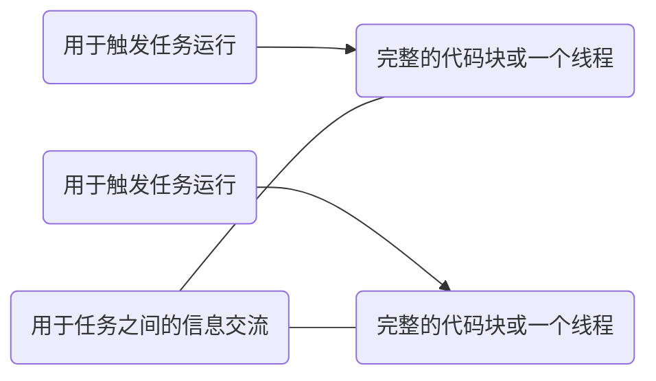
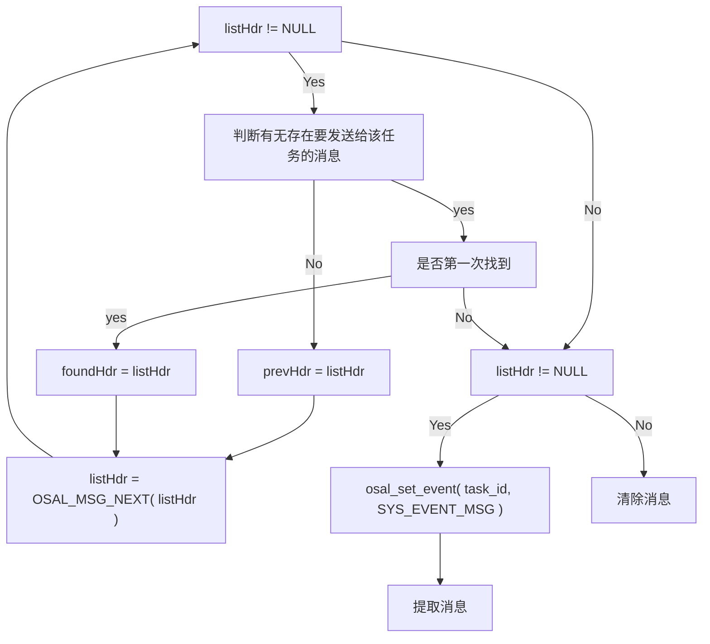

## 1. OSAL的思想起源

本部分拟通过研究相关文献总结出OSAL (Operating System Abstraction Layer) 的产生原因以及思想起源。

### 1.1 早期WSN的架构

在早期WSN的软件架构中，开发环境是极其轻量的 (Lightweight)，开发者直接操控硬件进行开发：



在这种软件架构下，存在以下四种限制：

+ **与硬件依赖 (Hardware dependent)的应用端程序**
  开发者直接面向硬件底层，应用端程序的代码与低级硬件细节相耦合。例如，操纵硬件寄存器来进行网络控制。在这种情况下，当硬件提供的接口发生了变化将会影响开发者专注于应用端程序的开发，强迫开发者深入硬件细节。
+ **没有分离开的独立进程 (Independent process)**
  在这种架构下，只存在一个进程。这样就迫使开发者组合不同应用程序代码，这样就导致组合出来的程序在**数据请求**、**数据处理**、**时间同步**会相互关联，使得程序可读性变差，难以调试。
+ **无法对时间进行控制**
  由于在一个程序里组合了不同的应用代码，使得对于时间进行精确的掌控变得尤为困难。只要改变了一部分涉及到延迟的代码，整个系统的时间将会发生变化。
+ **无处理器分配机制**
  程序始终顺序执行不同的应用代码，处理器无法获得任何优先权。

随着发展，WSN的架构在硬件上为开发者提供了一些十分重要的抽象：



+ **基本函数 (Basic function) 层**
  是一个功能十分简单的层，提供以下基础功能：

  + 对寄存器进行读、写功能
  + 产生硬件中断，将中断信息传递给上层

+ **中断服务程序 (Interrupt Service Routines ISR) 层**
  用于处理中断，并且能够对信号量 (semaphore) 进行管理，对硬件进行基本的处理。

+ **硬件表示层 (HPL)**
  提供一个完整的接口用于硬件和应用之间的交互。

我们下面介绍操作系统的使用，WSN社区广泛使用了一系列操作系统 (OS, Operating System)，尽管这些不同的操作系统几乎都提供具有相同功能的服务，但是它们使用了不同的应用编程接口 (API, Application Programming Interface)，从而使可移植性 (Portability) 变得更加困难，对于不同平台，提供的API 不相同，导致代码的兼容性较差。

### 1.2 OSAL的提出

通过上述分析可知，对于不同的硬件平台以及操作系统提供的不同API 都会导致软件的可移植性变差。因此，人们提出了一个新的想法：**在操作系统API与应用端之间的交互上，再提供一层抽象**，这个抽象就是OSAL：



OSAL为应用端提供了对操作系统API的一个抽象，就是为了解决不同操作系统提供功能相同的服务但却不具备相同API的问题。这样当软件代码要移植到不同的操作系统时，仅仅只需要重新定义OSAL的相关功能，但并不改变OSAL为用户提供的接口，也就是OSAL API。

### 1.3 小结

通过上述分析可知，我们可以得出以下结论：

+ OSAL 的产生的根本目的是为了提高**代码的可移植性**
+ OSAL 在严格意义上并不是操作系统，只是对于不同操作系统的API 进行了**一层抽象**，统一了用户接口

### 2. TI OSAL

本部分拟对TI公司的 Z-Stack 中的OSAL 进行一个大致的介绍。首先通过查阅TI公司相关手册，给出TI公司文档中对于OSAL API的一些解释：

> The purpose of this document is to define the OS Abstraction Layer (OSAL) API. This API allows the software components if a TI stack product, such as Z-Stack, RemoTI, and BLE, to be written independently of the specifics of the operating system, kernel of tasking environment.

通过上述引用可知，TI 公司设计OSAL API的目的也是在于开发者使用不同的协议栈面对的接口是一致的。实际上Z-Stack 协议栈并不具备实际的操作系统，但是TI 公司有三个协议栈均提供的是相同的OSAL API。可见TI 公司也是通过抽象的方式统一了提供给开发者的接口。

所以严格来讲，Zigbee 使用TI 公司的Z-Stack，而Z-Stack 中的OSAL 提供的仅仅是一层抽象，并不是严格意义上的操作系统。下面，从不同的角度通过对Z-Stack 的OSAL 进行一个系统化以及模块化的大致分析。

### 2.1 Zigbee总体架构

首先，根据查阅相关资料，绘出Zigbee的总体架构如下图所示：



从图中我们可以认为，OSAL 就是Zigbee的一个“操作系统”给开发者提供了一些接口也就是OSAL API ，在下面的部分我们会对OASL 进行一个整体分析。

### 2.2 OSAL概述

OSAL 提供了如下的功能：

+ **任务注册、初始化以及开始 (Task registration, initialization, starting)**
+ **任务之间的消息交换 (Message exchange between tasks)**
+ **任务同步 (Task synchronization)**
+ **中断处理 (Interrupt handling)**
+ **定时器 (Timers)**
+ **内存分配 (Memory allocation)**

下面对OSAL 中的一些基本概念进行阐述。

首先给出任务 (Tasks)、事件 (Events) 与 消息 (Messages)之间的关系：



接下来，我们对这三个基本概念进行阐述。

任务具有如下的性质 (property)：

+ 任务是由初始化段 (initialization section)和运行段 (run-time section)组成的
+ 一旦任务开始执行，任务将会**运行到结束 (run to completion)**
+ 事件使任务执行运行段代码

事件是整个架构中的最底层的实现。

消息定义为**内部任务的通信 (Inter-Task Communication)**：


+ 消息是由OSAL 管理的
+ 用于触发任务之间的通信以及内部命令传递

任务之间的调度遵循两个原则：

+ 任务将会运行到结束 (run to completion)
+ **任务服务的无限循环 (Round-robin task servicing loop)**

标准C语言中 `malloc()` 和 `free()` 内存操作并不知晓具体的硬件细节，因此OSAL提供了具有相同功能但是扩展了的函数以方便开发者管理堆上的动态内存。

+ `osal_mem_alloc()`：动态分配一个缓存区，返回指向该缓存区的指针。
+ `osal_mem_free()`：释放动态分配的缓存区。

定时器 (Timer) 使得开发者能够轻易地对**内部任务 (Internal tasks)**和**外部任务 (External or application level)**进行时间上的操作，从而解决了在第一部分讲述的缺点：**无法对时间进行控制**。

时钟 (Clock) 提供了追踪设备日期和时间的功能，从而在一定程度上使得开发者能够对时间进行一个更好的管理。

### 2.3 小结

通过上述对OSAL 的一些基本功能介绍，我们大致地了解了OSAL 的一个基本架构，可以看出OSAL 的提出解决了我们在第一部分提出的相应的问题：对时间、任务管理以及软件与硬件分离问题。

下面我们将通过对Z-Stack 中具体代码的分析，加深对OSAL 的理解。

## 3. 消息 (Messages)

本部分，我们深入探讨**消息 (Messages)**。我们将研究OSAL 中与消息部分相对应的源代码，通过对源代码的研究一步一步揭示消息在OSAL中的重要作用及其实现机制。

### 3.1 消息数据结构的实现

一个消息的基本数据结构定义在文件 `OSAL.h` 中，如下所示：

```c
typedef sturct {
    void *next;    // 用于链表的基本实现
    uint16 len;    // 元数据 (meta data)：消息的长度
    uint8 dest_id; // 元数据 (meta data)：消息的目的地
} osal_msg_hdr_t;
```

其中 `uint16` 和 `uint8`的定义在 `hal_types.h` 文件中：

```c
typedef unsigned char   uint8;  // 1个字节
typedef unsigned short  uint16; // 2个字节
```

若读者接触过数据结构，可以发现这是一个链表中的结点。

消息的数据结构只保存了一些**元数据 (meta data)**：消息的长度 `len` 以及目的地 `dest_id` 并没有保存消息的内容。在消息这一部分内容中，我们并不会深入消息的内容是怎么产生的，我们的关注点在于消息数据结构及算法的实现。

下面，我们开始分析与消息相关的算法操作。

### 3.2 消息的创建

消息的创建是通过 `osal_msg_allocate()` 实现的，定义在 `OSAL.c` 文件中：

```c
uint8 * osal_msg_allocate(uint16 len) {
    osal_msg_hdr_t *hdr; // 定义了一个结构体指针。
    if( len == 0)
        return ( NULL ); // 若长度为0，则返回空指针。
    // 利用osal_mem_alloc() 动态分配内存。
    hdr = (osal_msg_hdr_t *)osal_mem_alloc((short)(len + sizeof( osal_msg_hdr_t )));
    if (hdr) { // 如果动态分配内存成功
        hdr ->next = NULL;
        hdr ->len = len;
        hdr ->dest_id = TASK_NO_TASK;
        return ((uint8 *) (hdr + 1));
    }// 进行相应的赋值操作并返回指针。
    else // 如果动态分配内存失败
        return ( NULL ); // 返回空指针
}
```

由上述代码可知，消息的创建过程与传统的链表结点的创建过程是比较类似的，但是有一些特别的地方如下：

+ 定义一个 `osal_msg_hdr_t` 结构体指针，为其动态分配内存。分配的动态内存大小为 `len+sizeof(osal_msg_hdr_t)`。
+ 返回的指针为 `(uint8 *) (hdr +1)`。

可见，消息包含了两个部分：

+ **元数据**：`sizeof(osal_msg_hdr_t)` 部分
+ **内容**：`len` 部分

上述的表述可以用下图表示：


我们可以看出，消息的创建对消息的元数据部分进行了处理，并提供了一个缓存区用于保存消息的内容，在与消息相关的API中并不会进行对消息实际内容的处理，**因此调用创建消息的API会返回一个指向缓存区的指针，用于保存消息的内容**。在此，我们得出了一个重要结论：从数据结构的角度来看，**消息是一个指针，指向的是缓存区，也就是消息的内容，在其前有一个元数据区，队列是通过元数据区的指针相连接的**。

### 3.3 消息的释放

由于消息是通过动态内存分配的方式，故必须有对应的函数用于释放内存，消息的释放是通过 `osal_msg_deallocate()` 函数实现的，定义在`OSAL.c` 文件中：

```c
uint8 osal_msg_deallocate(uint8 *msg_ptr) {
    uint8 *x;
    if(msg_prt == NULL) // 如果消息指向空指针
        return (INVALID_MSG_POINTER); //指针不合法
    if(OSAL_MSG_ID( msg_ptr )!= TASK_NO_TASK) {
         return (MSG_BUFFER_NOT_AVAIL ); // 不能释放进入队列的消息
    }
    // 只释放内容区，也就是buffer区。
    x = (uint8 *)((uint8 *)msg_ptr - sizeof( osal_msg_hdr_t ));
    osal_mem_free( (void *)x );
    return ( SUCCESS);
}
```

通过代码我们可以得到如下的结论：

+ **不能释放已经进入队列的消息**，因为进入了队列的消息是要进行处理的。（原因将会在后面描述）
+ 释放的内存仅仅释放消息的内容，不会释放消息的元数据。

### 3.4 消息队列

通过上述的分析，我们已经介绍了消息的数据结构、消息的创建及释放。下面，我们介绍消息队列的实现。在数据结构中，队列的实现需要两个特殊的指针，**队首指针 (front pointer)**和**队尾指针 (rear pointer)**。在OSAL中，只采用了**队首指针**。

队首指针定义在 `OSAL.c` 中，是一个全局变量。

```c
osal_msg_q_t osal_qHead;
```

在初始化的过程中，会被设置为 `NULL`。

#### 与消息队列操作有关的宏变量

在 `OSAL.h` 中定义了一些与消息队列操作有关的宏变量：

```c
// 指向下一个消息结点
#define OSAL_MSG_NEXT(msg_ptr)    ((osal_msg_hdr_t *) (msg_ptr) - 1)->next
// 得出消息的元数据：长度
#define OSAL_MSG_LEN(msg_ptr)     ((osal_msg_hdr_t *) (msg_ptr) - 1)->len
// 得出消息的元数据：目的地
#define OSAL_MSG_ID(msg_ptr)      ((osal_msg_hdr_t *) (msg_ptr) - 1)->dest_id
// 取得消息队列的队首指针的值，即位于队首的消息
#define OSAL_MSG_Q_HEAD(q_ptr)    (*(q_ptr))
// 将队首指针进行初始化
#define OSAL_MSG_Q_INIT(q_ptr)     *(q_ptr) = NULL
// 判断队列是否为空
#define OSAL_MSG_Q_EMPTY(q_ptr)   (*(q_ptr) == NULL)
```

我们可以看出OSAL 对开发者屏蔽了一些细节，所有对于消息结点的操作，均会对指针进行减1操作。所以实际上OSAL消息队列操作的是元数据区，对于开发者而言，开发者总是在控制消息的内容。上述的观点可用下图表示：


#### 进队的实现

进队的操作是由函数 `osal_msg_enqueue()` 实现的，定义在 `OSAL.c` 文件中：

```c
void osal_msg_enqueue(osal_msg_q_t *q_ptr, void *msg_ptr) {
    void *list;
    halIntState_t intState;
    HAL_ENTER_CRITICAL_SECTION(intState); // 进入临界区，关中断，实现同步与互斥。
    OSAL_MSG_NEXT( msg_ptr ) = NULL; // 消息的元数据指向NULL。
    if (*q_ptr == NULL) { // 当队列空的时候，直接入队，并将对首指针指向消息
        *q_ptr = msg_ptr;
    }
    else {
        // 遍历，找到队尾指针。
        for (list = *q_ptr; OSAL_MSG_NEXT( list ) != NULL; list = OSAL_MSG_NEXT( list ));
        // 将消息插入队尾。
        OSAL_MSG_NEXT( list ) = msg_ptr;
    }
    // 开启中断，退出临界区。
    HAL_EXIT_CRITICAL_SECTION(intState);
}
```

由上述代码可知，进队的实现是比较基本的算法实现，此处我们并不深入讲述 `HAL_ENTER_CRITICAL_SECTION(intState)`以及 `HAL_EXIT_CRITICAL_SETCION(intState)`，我们将在后面专门阐述OSAL 同步与互斥的实现。

#### 出队的实现

出队的操作是由函数 `osal_msg_dequeue()` 函数实现的，定义在 `OSAL.c` 中：

```c
void *osal_msg_dequeue(osal_msg_q_t *q_ptr) {
  void *msg_ptr = NULL;
  halIntState_t intState;
    HAL_ENTER_CRITICAL_SECTION(intState); // 进入临界区，关中断。
    if ( *q_ptr != NULL ) { // 队列不为空
        msg_ptr = *q_ptr; // 指向队首结点。
        *q_ptr = OSAL_MSG_NEXT( msg_ptr ); // 队首指针指向其下一个结点。
        OSAL_MSG_NEXT( msg_ptr ) = NULL; // 删除其指向的结点。
        OSAL_MSG_ID( msg_ptr ) = TASK_NO_TASK; // 置其不在队列中
    }
    HAL_EXIT_CRITICAL_SECTION(intState); //退出临界区，开中断。
    return msg_ptr;
}
```

### 3.5 消息的传递

我们已经讲述了消息队列的数据结构实现和其对应的某些操作，下面我们介绍消息的传递的实现，在这里我们并不会给出具体的代码实现，更不会结合事件和任务进行分析，我们只给出这两个重要的API，并在后面专门阐述这两个API的代码实现。

+ 消息的发送：`osal_msg_send()`
+ 消息的接收：`osal_msg_receive()`

### 3.6 小结

在这一节中，我们介绍了消息的数据结构，以及消息的数据结构的实现。我们在这一节并没有深入讨论消息的传递，原因是读者对于任务和事件的概念并没有一个深刻的理解，在讲述了任务和事件的概念后，我们会深入消息的传递。

## 4. 任务 (Tasks) 与事件 (Events)

这一节中，我们深入OSAL 中的**任务 (Tasks) 和事件 (Events)**。在讲述任务之前，我们先介绍循环机制的实现。

### 4.1 循环机制的实现

在 `Zmain.c` 文件中，`main()` 函数出现了一个OSAL提供的API：`osal_start_system()`。

```c
int main (void) {
    /*
      其他初始化操作
    */
    osal_start_system(); // 永不返回
    return 0;
}
```

TI 公司给出的官方文档解释如下：

> This function is the main loop function of the task system, repeatedly calling osal_run_system(), from an infinite loop. This function never returns.

从官方文档可以看出，OSAL 是一个**死循环 (Forever loop)**机制，下面对相关代码进行研究：

```c
void osal_start_system( void ) {
    for (; ;) // 死循环{
        unit8 idx = 0;
      // 其他操作
      do {
            if( tasksEvents[idx]) break; // 如果某个任务有事件发生
        }while(++idx < tasksCnt);
      if (idx < tasksCnt) {
          uint16 events; // 定义一个事件作为临时变量
          HAL_ENTER_CRITICAL_SECTION(intState); // 进入临界区，关中断
          events = tasksEvents[idx]; // 读事件
          tasksEvents[idx] = 0; // 置为0
          HAL_EXIT_CRITICAL_SECTION(intState); // 退出临界区，开中断
          events = (tasksArr[idx])( idx, events ); // 执行事件处理函数
          HAL_ENTER_CRITICAL_SECTION(intState); // 进入临界区，关中断
          tasksEvents[idx] |= events; // 加入没有处理的事件
          HAL_EXIT_CRITICAL_SECTION(intState);// 退出临界区，开中断
      }
}
```

从上述的代码可以看出，当程序一旦进入了  `osal_start_system()`, 将会产生以下的操作过程：

+ idx 从 `0~tasksCnt` 进行扫描，发现 `tasksEvents[idx]` 的值不为0，停止扫描
+ 然后读取 `tasksEvents[idx]` 的值，并执行 `events = (tasksArr[idx])( idx, events )`
+ 最后再执行一步操作：`tasksEvents[idx] |= events`

#### tasksEvents[]

`tasksEvents` 定义在文件 `OSAL_GenericApp.c` 中，是一个全局变量：

```c
uint16 *tasksEvents; // 定义了一个指向2个字节的指针
```

其初始化定义在该文件中的 `osalInitTasks` 函数中：

```c
tasksEvents = (uint16 *)osal_mem_alloc( sizeof( uint16 ) * tasksCnt); // 动态分配内存
```

从这里，我们可以看出 `tasksEvents` 是一个动态分配的数组，在 `osal_start_system()` 中对其索引值不断进行扫描，若发现对应的值不为零，停止扫描，然后去做相应的处理。在上述的函数中，出现了 `tasksCnt` 这个变量，其定义如下：

```c
const uint8 tasksCnt = sizeof( tasksArr ) / sizeof( tasksArr[0] );
```

从这个代码可以看出，`tasksEvents[]` 的长度是由 `tasksArr` 这个变量决定的，下面我们研究 `tasksArr`。

#### tasksArr[]

`tasksArr` 定义在文件 `OSAL_GenericApp.c` 中，是一个全局变量：

```c
const pTaskEventHandlerFn tasksArr[] = {
  macEventLoop,
  nwk_event_loop,
  Hal_ProcessEvent,
#if defined( MT_TASK )
  MT_ProcessEvent,
#endif
  APS_event_loop,
#if defined ( ZIGBEE_FRAGMENTATION )
  APSF_ProcessEvent,
#endif
  ZDApp_event_loop,
#if defined ( ZIGBEE_FREQ_AGILITY ) || defined ( ZIGBEE_PANID_CONFLICT )
  ZDNwkMgr_event_loop,
#endif
  GenericApp_ProcessEvent
};
```

其中 `pTaskEventHandlerFn` 定义在 `OSAL_Tasks.h` 中：

```c
typedef unsigned short(*pTaskEventHandlerFn)
    ( unsigned char task_id, unsigned short event );
```

可见 `taksArr` 保存的数据类型为**函数指针，即指向函数的指针**。我们可以看出，当确定了 `idx` 的值以后，读取 `tasksArr[idx]` 的值，然后执行相应的函数。

### 4.2 任务的概念

任务到底是什么？在OSAL中，任务是一个抽象的概念，是OSAL 最顶层的抽象。我们通过代码对任务的概念一步步进行探究：

任务是由**初始化段 (initialization section)**和**运行段 (run-time section)**组成的。所以任务在运行之前必然先进行初始化，初始化的工作是在 `OSAL_GenericApp.c` 中定义的：

```c
void osalInitTasks( void ) {
    uint8 taskID = 0;
    tasksEvents = (uint16 *)osal_mem_alloc( sizeof( uint16 ) * tasksCnt);
    osal_memset( tasksEvents, 0, (sizeof( uint16 ) * tasksCnt));
    macTaskInit( taskID++ );
    nwk_init( taskID++ );
    Hal_Init( taskID++ );
#if defined( MT_TASK )
    MT_TaskInit( taskID++ );
#endif
    APS_Init( taskID++ );
#if defined ( ZIGBEE_FRAGMENTATION )
    APSF_Init( taskID++ );
#endif
    ZDApp_Init( taskID++ );
#if defined ( ZIGBEE_FREQ_AGILITY ) || defined ( ZIGBEE_PANID_CONFLICT )
    ZDNwkMgr_Init( taskID++ );
#endif
    GenericApp_Init( taskID );
}
```

从任务的初始化代码中，我们可以看到，每一个任务有一个与其对应的初始化函数，传入了一个 `taskID`。由此可知，OSAL 可以拥有很多个不同的任务，任务通过 `taskID` 进行标识，这一部分是与 `idx` 索引值相对应的。

```c
do {
    if(tasksEvents[idx]) break;
}while(++idx < tasksCnt);
```

所以，这一段代码的意义我们就可以进行解释：遍历不同任务的 `taskEvents` 的值，如果 `taskEvents` 的值不为零则停止遍历。在前面，我们已经讲述了 `tasksEvents` 的数据类型，但是并没有讲述其意义。下面我们引入事件的概念。

### 4.3 事件的概念

事件的概念：**一个需要通过任务来完成的动作**。通俗地说，事件**驱动着任务**。一个事件必须具有标识的功能，OSAL 定义了`event_flag` 是由2个字节也就是16位组成的，每一位代表了一个事件，1代表有事件产生，0代表没有事件产生，如图2 所示：


事件从代码的角度上，实现尤其简单。下面，我们再次分析  `tasksEvents[]` 和 `tasksArr[]`，更深入理解任务和事件。

### 4.4 任务与事件的关系

我们先分析 `taskEvents[idx]`，其中 `idx` 对应的是任务号，而 `tasksEvents[idx]` 的值是多少呢？在4.1 节部分我们给出了如下所示的代码：

```c
tasksEvents = (uint16 *)osal_mem_alloc( sizeof( uint16 ) * tasksCnt); // 动态分配内存
```

显然，通过代码可知 `taskEvents[idx]` 可知其保存的大小为2个字节，正好与事件的 `event_flag` 相对应。这样我们可以给 `tasksEvents[]` 数组下定义：**任务事件数组**，用于保存某个任务的事件信息。

我们再分析 `tasksArr[]` 数组，我们通过上述的分析，`tasksArr[]` 数组保存的内容是函数指针，其类型为：

```c
typedef unsigned short(*pTaskEventHandlerFn)
    ( unsigned char task_id, unsigned short event );
```

因此，我们可以给  `tasksArr[]` 数组下定义：**任务处理数组**，当发现任务事件数组不为空的时候，证明有事件产生，于是转向任务处理数组，调用函数，并传递两个参数：

+ `tasks_id`：任务标识号
+ `event`: 事件的 `event_flag`

总结如下图所示：


```c
UINT16 GenericApp_ProcessEvent( byte x, UINT16 events ) {
    if ( events & SYS_EVENT_MSG ) {
        // do something
    }
    if (events & GENERICAPP_SEND_MSG_EVT ) {
        // do something
    }
}
```

显然，在这个函数中，通过传入的 `events` 事件分别与已经定义好的宏变量进行**按位与**就可以判断是哪个事件，从而处理该事件。在这里，我们只给出了宏观的一个实现，并没有讲述代码的具体实现。但是通过上述的分析，我们已经明确了**事件驱动任务**。但是，我们仍然有一个十分重要的问题没有处理：

+ 为何事件的值即  `tasksEvents[idx]` 会发生改变？也就是说事件是如何被捕获的。

## 5. 消息传递机制

这一部分，我们将综合任务、事件和消息，进行一个完整过程的阐述。

### 5.1 消息的发送与接收

消息的发送是通过定义 `OSAL.c` 文件中的 `osal_msg_send()` 函数定义的：

```c
uint8 osal_msg_send( uint8 destination_task, uint8 *msg_ptr ) {
    if (msg_ptr == NULL) // 指针为空返回错误信息
        return (INVALID_MSG_POINTER);
     // 如果要发送的任务号大于系统定义的最大任务号
    if (destination_task >= tasksCnt) {
        osal_msg_deallocate( msg_ptr );
        return ( INVALID_TASK );
    }
    // 检查元数据，是否为错误的消息
    if ( OSAL_MSG_NEXT( msg_ptr ) != NULL ||
       OSAL_MSG_ID( msg_ptr ) != TASK_NO_TASK ) {
        osal_msg_deallocate( msg_ptr );
        return ( INVALID_MSG_POINTER );
    }
    // 设置其元数据的目的地址
    OSAL_MSG_ID( msg_ptr ) = destination_task;
    // 将该消息进队
    osal_msg_enqueue( &osal_qHead, msg_ptr );
    // 告知任务有消息需要处理
    osal_set_event( destination_task, SYS_EVENT_MSG );
    return (SUCCESS)
}
```

这一过程可用下图表示：


注意函数 `osal_set_event()` 的使用，这是一个十分关键的函数，我们首先分析其源代码：

```c
uint8 osal_set_event( uint8 task_id, uint16 event_flag ) {
    if (task_id < tasksCnt) {
        halIntState_t   intState;
        HAL_ENTER_CRITICAL_SECTION(intState); // 关中断
        tasksEvents[task_id] |= event_flag;
        HAL_EXIT_CRITICAL_SECTION(intState);// 开中断
    }
    else {
        return (INVALID_TASK);
    }
}
```

这个函数有两个参数，一个是 `task_id`，另一个是 `event_flag`，执行了一个特别重要的操作：

```c
tasksEvents[task_id] |= event_flag; // 按位或并赋值
```

这样就通过了这个函数，改变了 `tasksEvents[idx]` 的值，从而在下一次扫描的时候，处理该事件。**按位或**的目的在于不能够影响其他已经存在的未经处理的事件。

其次，在消息发送的函数中第二个参数的值为 `SYS_EVENT_MSG`。其值为 `0x8000`。从这一点，我们必须认识到**消息**是**系统层次的事件**，也就是说，**消息是只能够存在在系统事件中的，这是消息发送这个函数所规定的。**

消息的接收是通过定义 `OSAL.c` 文件中的 `osal_msg_receive()` 函数定义的：

```c
uint8 *osal_msg_receive( uint8 task_id ) {
    osal_msg_hdr_t *listHdr; // 定义一个消息结构体指针
    osal_msg_hdr_t *prevHdr = NULL;
    osal_msg_hdr_t *foundHdr = NULL;
    halIntState_t   intState;
    HAL_ENTER_CRITICAL_SECTION(intState); // 进入临界区，关中断。
    listHdr = osal_qHead; // 指向队首指针
    // 遍历队列
    while ( listHdr != NULL ) {
        // 如果某个消息的目的地是 task_id
        if ((listHdr - 1)->dest_id == task_id) {
            // 第一次找到
            if ( foundHdr == NULL ) {
                 foundHdr = listHdr;
             }
            else break;
        }
        if (foundHdr == NULL) {
            // 保存找到的消息之前的消息
            // 方便进行删除操作
            prevHdr = listHdr;
        }
        listHdr = OSAL_MSG_NEXT( listHdr ); // 遍历
    }
    // 不为空，证明为遍历完，也就是存在多个消息
    if ( listHdr != NULL ) {
        // 告知任务还有消息在等待处理
        osal_set_event( task_id, SYS_EVENT_MSG );
    }
    else {
        osal_clear_event( task_id, SYS_EVENT_MSG );
    }
    // 找到了消息
    if (foundHdr != NULL) {
        // 提取出这个消息
        osal_msg_extract( &osal_qHead, foundHdr, prevHdr );
    }
    HAL_EXIT_CRITICAL_SECTION(intState);// 退出临界区，开中断。
    return ( (uint8*) foundHdr ); // 返回消息
}
```

消息的接收过程可以用下图表示：



通过上述的过程，我们已经可以总结出事件是如何捕获的了，事件的捕获是通过函数 `osal_set_event()` 实现的。

### 5.2 任务处理函数

在第4节中，我们仅仅简单地讲述了任务处理函数，下面我们通过一个具体的例子进行说明：

```c
UINT16 GenericApp_ProcessEvent( byte x, UINT16 events ) {
    if ( events & SYS_EVENT_MSG ) {
        MSGpkt = (afIncomingMSGPacket_t *)osal_msg_receive( GenericApp_TaskID );
        while (MSGpkt) {
            switch(MSGpkt) {
                    case ZDO_CB_MSG:
                      GenericApp_ProcessZDOMsgs( (zdoIncomingMsg_t *)MSGpkt );
                      break;
                    case ZDO_CB_MSG:
                      GenericApp_ProcessZDOMsgs( (zdoIncomingMsg_t *)MSGpkt );
                      break;
                  default: break;
              }
            osal_msg_deallocate( (uint8 *)MSGpkt ); // 释放消息
            // 处理该事件的下一个消息
            MSGpkt = (afIncomingMSGPacket_t *)osal_msg_receive( GenericApp_TaskID );
        }
        return (events ^ SYS_EVENT_MSG) // 返回未处理的事件
    }
}
```

我们从上面的代码可以看出，首先进入了任务处理函数，会去优先处理系统事件，再次强调，**消息只能在系统时间中处理，这是OSAL 规定好了的**。首先利用 `osal_msg_receive()` 函数从消息队列中获得有关该层任务的消息，然后根据发送的消息提供的信息，作出相应的操作，然后释放该消息并去处理下一个消息。

### 5.3 小结

至此，我们已经基本讲清了事件驱动机制的一个实现过程，希望对读者了解这个机制有所帮助。
