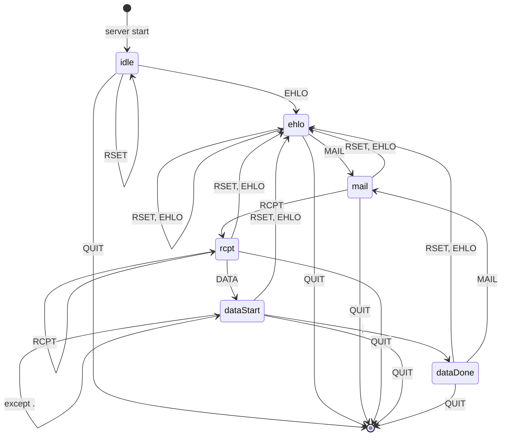

+ [手把手教你写一个简单的SMTP服务器（一）](https://luolibrary.com/2023/03/12/%E6%89%8B%E6%8A%8A%E6%89%8B%E6%95%99%E4%BD%A0%E5%86%99%E4%B8%80%E4%B8%AA%E7%AE%80%E5%8D%95%E7%9A%84SMTP%E6%9C%8D%E5%8A%A1%E5%99%A8%EF%BC%88%E4%B8%80%EF%BC%89/)
+ [手把手教你写一个简单的SMTP服务器（二）](https://luolibrary.com/2023/03/14/%E6%89%8B%E6%8A%8A%E6%89%8B%E6%95%99%E4%BD%A0%E5%86%99%E4%B8%80%E4%B8%AA%E7%AE%80%E5%8D%95%E7%9A%84SMTP%E6%9C%8D%E5%8A%A1%E5%99%A8%EF%BC%88%E4%BA%8C%EF%BC%89/)
+ [手把手教你写一个简单的SMTP服务器（三）](https://luolibrary.com/2023/03/14/%E6%89%8B%E6%8A%8A%E6%89%8B%E6%95%99%E4%BD%A0%E5%86%99%E4%B8%80%E4%B8%AA%E7%AE%80%E5%8D%95%E7%9A%84SMTP%E6%9C%8D%E5%8A%A1%E5%99%A8%EF%BC%88%E4%B8%89%EF%BC%89/)
+ [手把手教你写一个简单的SMTP服务器（四）](https://luolibrary.com/2023/03/14/%E6%89%8B%E6%8A%8A%E6%89%8B%E6%95%99%E4%BD%A0%E5%86%99%E4%B8%80%E4%B8%AA%E7%AE%80%E5%8D%95%E7%9A%84SMTP%E6%9C%8D%E5%8A%A1%E5%99%A8%EF%BC%88%E5%9B%9B%EF%BC%89/)
+ [手把手教你写一个简单的SMTP服务器（五）](https://luolibrary.com/2023/03/14/%E6%89%8B%E6%8A%8A%E6%89%8B%E6%95%99%E4%BD%A0%E5%86%99%E4%B8%80%E4%B8%AA%E7%AE%80%E5%8D%95%E7%9A%84SMTP%E6%9C%8D%E5%8A%A1%E5%99%A8%EF%BC%88%E4%BA%94%EF%BC%89/)

---

在教程一中，我们已经完成了一个十分简单的TCP服务器。如果你跳过了教程一的某些部分，你可以执行以下的命令获取到在此阶段的代码：

```sh
git clone https://github.com/shejialuo/miniSMTPServer
cd miniSMTPServer && git checkout tcp-server
```

我们终于来到了有意思的部分了，我们要开始实现一个简单的SMTP协议。然而，RFC标准定义的SMTP协议过于复杂了，故本教程拟提取出一些核心的东西将其简化。

## 顺序定义

### 会话启动及客户端初始化

当客户端连接到服务器时，服务器会发送`220`代码加上其版本等信息。而客户端会发送`EHLO`命令，加上客户端的IP地址等自定义信息（在本教程中默认只发送IP地址，其值只能为127.0.0.1）。其过程如下所示：

```txt
S: 200 Service ready
C: EHLO 127.0.0.1
```

### 邮件事务

邮件的事务总共有三步：事务的开始是通过`MAIL`命令开始的，`MAIL`命令需要指定发送人的邮箱。然后是一系列的`RCPT`命令指定接收人的邮箱。最后是`DATA`命令指定邮件的内容有哪些，最后以单独的`.`命令表示内容的结束。

### 会话结束

当客户端向服务器发送`QUIT`命令时，服务器发送回复就意味着本次SMTP会话的终结。

### 命令顺序限制

+ 必须使用`EHLO`命令开启一个新的会话。
+ `EHLO`命令可以在任何一个状态使用，其的使用将会清楚SMTP服务器所有的状态，其存储的发送人、收件人和邮件内容等缓存必须全部清空，该效果等同于客户端发送`RSET`命令一样。
+ `RSET`命令可以在任意阶段使用，哪怕没有收到客户端发送的`EHLO`命令。
+ `MAIL`命令开启一个新的邮件事务，其后面只能按照顺序依次接多个`RCPT`命令，然后是多个`DATA`命令。客户端可以通过`RSET`和`EHLO`命令重置本次邮件事务。当开启了一个新的邮件事务，`MAIL`命令就再也无法使用。在这个过程中，如果命令的参数不正确，服务器端必须发送`501`代码，且服务器维持的状态不能有任何的改变。如果命令顺序不对，服务器端就发送`503`代码。
+ 会话里面最后的一个命令必须是`QUIT`。

## 请求和响应

为了简单起见，我们首先定义如下的全局规则：客户端的每次请求必须恰好对应一次服务器的响应。除第一次的客户端请求外，客户端都必须在收到服务器对其上一次请求的响应后才能进行下一次的请求。

### 请求

我们只支持如下的6个请求，下面的请求有些需要使用参数，有些不需要使用参数，我们会在实现具体的命令功能时再进行详细的介绍，现在我们先从整体的角度出发：

+ `EHLO`：客户端请求开始会话。
+ `MAIL`：客户端开始邮件事务。
+ `RCPT`：指定收件人。
+ `RSET`：重置会话。
+ `NOOP`：空操作。
+ `QUIT`：结束会话。

### 返回值

对于返回值，我们给出如下的定义：

+ `220`: Service ready
+ `221`: Service closing transmission channel
+ `250`: Requested mail action okay, completed
+ `354`: Start mail input; end with \<CRLF\>.\<CRLF\>
+ `500`: Syntax error, command unrecognized
+ `501`: Syntax error in parameters or arguments
+ `503`: Bad sequence of commands

## 状态机

经过上述对协议规则的详细解释，我们可以作出下图所示的状态转换图。当客户端输入的命令与该状态转换图对应不上时，服务器端需要输出`503`错误代码。



由上图可知，我们根据规则设定了六个状态：`idle`, `ehlo`, `mail`, `rcpt`, `dataStart`和`dataDone`。在上述的状态图中，我们忽略了唯一一个命令`NOOP`，由于`NOOP`没有操作，就没有在图里面展示出来了。

## 代码实现状态机

我们该如何通过代码实现上述的状态机了，有一个最简单的方式，就是定义一个`enum class State`包含状态机的6种状态，然后服务器端根据接收到的命令和目前现在维护的状态，判断是否应该前往下一步，其示例代码如下所示：

```c++
enum class State{
  ...
};

if (state == State::idle && command == "ehlo") {
  ...
} else if (state == State::rcpt && command == "quit") {
  ...
} else if (...) {
  ...
}
```

这样的代码是实现状态机最简单的方式，但是却是最不好的方式，原因如下：

1. 缺乏扩展性。如果我们的状态机新增了一个状态，我们需要不断地增加分支。
2. 不断增加的分支会让代码的可读性下降。

本教程拟采用c++运行时绑定机制（多态）来实现状态机，其基本的思路在于创建一个`Context`类，该`Context`类包含一个指向`State`类的指针，每当服务器收到了客户端发送的请求后，`Context`类将会执行`State`类的某个方法，根据该方法判断能否移动状态，进而处理客户端发送的请求。

因此我们需要定义虚基类`State`，此处我们必须尽最大可能抽象出基类应该所具备的能力。尽可能让代码变得干净一些。

+ 首先，我们在`miniSMTPServer/context/state.hpp`定义两个静态变量，其中一个为`commands`，表示所有能够接收的命令。其次是`codeToMessages`表明映射关系。

  ```c++
  // miniSMTPServer/context/state.cpp
  static std::unordered_set<std::string> commands{"EHLO", "MAIL", "RCPT", "RSET", "NOOP", "QUIT", "DATA", "."};

  static std::unordered_map<std::string, std::string> codeToMessages{
      {"220", "Service ready"},
      {"221", "Service closing transmission channel"},
      {"250", "Requested mail action okay, completed"},
      {"354", "Start mail input end <CRLF>.<CRLF>"},
      {"500", "Syntax error, command unrecognized"},
      {"501", "Syntax error in parameters or arguments"},
      {"503", "Bad sequence of commands"},
  };
  ```

+ 其次，对于所有的类都应该根据其自身现有的状态去判断是否应该接收当前的客户端命令。故每一个状态需要维护一个`allowed`的变量，存储当前状态允许接收的命令。显然，`allowed`变量需要具备快速查找能力，故使用`unordered_set`容器。同时，在`State`类中我们应该定义一个函数`canTransitive`用于实现该功能。在虚基类中，我们应该添加`RSET`，`EHLO`，`NOOP`，`QUIT`命令。无论服务器端处于什么样的状态，其都应该支持这些命令。对于客户端的命令，我们将其抽象为`std::vector<std::string>`。同时我们将该操作封装到`checkCommand`函数中。

  ```c++
  // miniSMTPServer/context/state.hpp
  class State {
  protected:
    /**
    * @brief allowed operations for each state, it should be used in
    * derive class, so make it protected.
    *
    */
    std::unordered_set<std::string> allowed;

  public:
    /**
    * @brief Construct a new State object. It will initialize the `allowed`
    * for adding four commands.
    *
    */
    State();

    /**
    * @brief can transitive to another state
    * @details check whether parameters[0] is in the allowed
    *
    * @param parameters the command and its parameters
    * @return true the command is OK for transition
    * @return false the command is not OK for transition
    */
    bool canTransitive(std::vector<std::string> &parameters);

    /**
    * @brief check the command whether it is in the command
    * and call `canTransitive`.
    *
    * @param parameters
    * @return std::optional<std::string>
    */
    std::optional<std::string> checkCommand(std::vector<std::string> &parameters);
  };
  ```

  ```c++
  // miniSMTPServer/context/state.cpp
  State::State() {
    allowed.insert("RSET");
    allowed.insert("EHLO");
    allowed.insert("QUIT");
    allowed.insert("NOOP");
  }

  bool State::canTransitive(std::vector<std::string> &parameters) { return allowed.count(parameters[0]); }

  std::optional<std::string> State::checkCommand(std::vector<std::string> &parameters) {
    if (!commands.count(parameters[0])) {
      return "500 " + codeToMessages["500"];
    }
    if (!canTransitive(parameters)) {
      return "503 " + codeToMessages["503"];
    }
    return std::nullopt;
  }
  ```

+ 当服务器端收到命令时，其处理的逻辑如下：首先需要判断客户端的命令是否存在于`commands`中，然后判断在该状态下是否能够接收该命令，即在上述定义的`checkCommand`函数的作用，最后需要判断参数是否正确。观察可发现，前三者在所有的状态中都是共通的，故我们需要直接在基类定义这些函数，我们已经定义好了`checkCommand`函数，因此需要再定义`isCorrectParameters`用于判断当前的参数是否正确。在目前，我们对此不做任何的处理，只让其返回空值。我们会慢慢地完善这个函数。

  ```c++
  // miniSMTPServer/context/state.hpp
  class State {
  public:
    ...
    /**
    * @brief is the parameters are correct
    *
    * @param[in] parameters the command and its parameters
    * @return std::optional<std::string>
    */
    std::optional<std::string> isCorrectParameters(std::vector<std::string> &parameters);
  };
  ```

  ```c++
  // miniSMTPServer/context/state.cpp
  std::optional<std::string> State::isCorrectParameters(std::vector<std::string> &parameters) {
    // TODO: finish later
    return std::nullopt;
  }
  ```

+ 最后我们定义纯虚函数 `transitive`，用于表征状态转换过程应该实现的操作：

  ```c++
  // miniSMTPServer/context/state.hpp
  class State {
  public:
    ...
    /**
    * @brief transitive to another state and return the response string.
    *
    * @param[in] parameters the command and its parameters
    * @param[out] current the current state
    * @return std::string the results should be sent back to the client
    */
    virtual std::string transitive(std::vector<std::string> &parameters, std::unique_ptr<State> *&current) = 0;
  };
  ```

+ 似乎现在我们已经尽可能地抽象出来了基类，但是我们还可以继续进一步地抽象，注意到`QUIT`和`NOOP`命令，对于任何状态来说，这个两个命令都是有确定的效果的。故我们直接可以在基类就直接处理。但是注意`QUIT`命令需要进行状态的转换，而我们现在却仅定义了一个虚基类，所以这部分我们将留在后面处理。同时，我们定义`transitiveHelper`函数抽象出所有状态都需要处理的操作。

  ```c++
  // miniSMTPServer/context/state.hpp
  class State{
  public:
    ...
    /**
    * @brief QUIT command handle
    *
    * @param[in] current the current state
    * @return std::string the response code
    */
    std::string transitiveFromQuit(std::unique_ptr<State> *&current);

    /**
    * @brief NOOP command handle
    *
    * @return std::string the response code
    */
    std::string transitiveFromNoop();

    /**
    * @brief The operations all the states need to do
    *
    */
    std::optional<std::string> transitiveHelper(std::vector<std::string> &parameters, std::unique_ptr<State> *&current);
  };
  ```

  ```c++
  // miniSMTPServer/context/state.cpp
  std::string State::transitiveFromQuit(std::unique_ptr<State> *&current) {
    // TODO: add transition later
    return "221 " + codeToMessages["221"];
  }

  std::string State::transitiveFromNoop() { return "250 " + codeToMessages["250"]; }

  std::optional<std::string> State::transitiveHelper(std::vector<std::string> &parameters,
                                                    std::unique_ptr<State> *&current) {
    if (auto result = checkCommand(parameters); result.has_value()) {
      return result.value();
    }

    if (auto result = isCorrectParameters(parameters); result.has_value()) {
      return result.value();
    }

    if (parameters[0] == "QUIT") {
      return transitiveFromQuit(current);
    }

    if (parameters[0] == "NOOP") {
      return transitiveFromNoop();
    }

    return std::nullopt;
  }
  ```

+ 别忘记了将析构函数设置为虚函数。

  ```c++
  // miniSMTPServer/context/state.hpp
  class State {
  public:
    virtual ~State() = default;
  };
  ```

最后别忘记了在再`miniSMTPServer/context`目录下创建`CMakeLists.txt`，同时修改`miniSMTPServer`中的`CMakeLists.txt`：

```cmake
# miniSMTPServer/context/CMakeLists.txt
add_library(context STATIC state.cpp)

# miniSMTPServer/CMakeLists.txt
...
add_subdirectory(./context)
```

然后你就可以再次执行命令进行编译，如果你遇到了任何编译的问题，你可以先使用`git add . && git stash`命令暂存你现在的工作区然后执行`git checkout state-class`发现你的错误。

## 小结

在我看来，我们已经完成了最难部分的工作。看似我们的代码很少，但是我们已经抽象出了状态图并构建了最基本的代码结构，剩下的工作我们只需要定义每一个状态即可，根据每个状态实现相应的函数即可。
