+ [手把手教你写一个简单的SMTP服务器（一）](https://luolibrary.com/2023/03/12/%E6%89%8B%E6%8A%8A%E6%89%8B%E6%95%99%E4%BD%A0%E5%86%99%E4%B8%80%E4%B8%AA%E7%AE%80%E5%8D%95%E7%9A%84SMTP%E6%9C%8D%E5%8A%A1%E5%99%A8%EF%BC%88%E4%B8%80%EF%BC%89/)
+ [手把手教你写一个简单的SMTP服务器（二）](https://luolibrary.com/2023/03/14/%E6%89%8B%E6%8A%8A%E6%89%8B%E6%95%99%E4%BD%A0%E5%86%99%E4%B8%80%E4%B8%AA%E7%AE%80%E5%8D%95%E7%9A%84SMTP%E6%9C%8D%E5%8A%A1%E5%99%A8%EF%BC%88%E4%BA%8C%EF%BC%89/)
+ [手把手教你写一个简单的SMTP服务器（三）](https://luolibrary.com/2023/03/14/%E6%89%8B%E6%8A%8A%E6%89%8B%E6%95%99%E4%BD%A0%E5%86%99%E4%B8%80%E4%B8%AA%E7%AE%80%E5%8D%95%E7%9A%84SMTP%E6%9C%8D%E5%8A%A1%E5%99%A8%EF%BC%88%E4%B8%89%EF%BC%89/)
+ [手把手教你写一个简单的SMTP服务器（四）](https://luolibrary.com/2023/03/14/%E6%89%8B%E6%8A%8A%E6%89%8B%E6%95%99%E4%BD%A0%E5%86%99%E4%B8%80%E4%B8%AA%E7%AE%80%E5%8D%95%E7%9A%84SMTP%E6%9C%8D%E5%8A%A1%E5%99%A8%EF%BC%88%E5%9B%9B%EF%BC%89/)
+ [手把手教你写一个简单的SMTP服务器（五）](https://luolibrary.com/2023/03/14/%E6%89%8B%E6%8A%8A%E6%89%8B%E6%95%99%E4%BD%A0%E5%86%99%E4%B8%80%E4%B8%AA%E7%AE%80%E5%8D%95%E7%9A%84SMTP%E6%9C%8D%E5%8A%A1%E5%99%A8%EF%BC%88%E4%BA%94%EF%BC%89/)

---

在教程三中，我们已经完成了`IdleState`的操作，那么接下来的核心就是完成其他所有类的操作。为了方便读者的阅读，我们继续给出在教程二中绘制出了的状态图。

```mermaid
stateDiagram-v2
    [*] --> idle: server start
    idle --> ehlo: EHLO
    idle --> idle: RSET

    ehlo --> mail: MAIL
    mail --> rcpt: RCPT
    rcpt --> rcpt: RCPT
    rcpt --> dataStart: DATA
    dataStart --> dataStart : except .
    dataStart --> dataDone: .

    ehlo --> ehlo: RSET, EHLO
    mail --> ehlo: RSET, EHLO
    rcpt --> ehlo: RSET, EHLO
    dataStart --> ehlo: RSET, EHLO
    dataDone --> ehlo: RSET, EHLO
    dataDone --> mail: MAIL

    idle --> [*]: QUIT
    ehlo --> [*]: QUIT
    mail --> [*]: QUIT
    rcpt --> [*]: QUIT
    dataStart --> [*]: QUIT
    dataDone --> [*]: QUIT
```



## EhloState

对于`EhloState`，首先我们应该考虑其能够接收的额外命令。由状态图可知，我们需要`MAIL`命令。因此我们需要在`allowed`中添加额外的`MAIL`。

```c++
// miniSMTPServer/context/state.cpp
EhloState::EhloState() { allowed.insert("MAIL"); }
```

同时，我们也需要在`isCorrectParameters`中添加对`MAIL`命令参数的判断。我们给出`MAIL`命令请求和响应的ABNF范式。在这个范式中，我省略了对邮件格式正确性的描述，因为我认为这不是这个教程的重点，在本教程中，我们统一使用如下的正则表达式`regex = "(\\w+)(\\.|_)?(\\w*)@(\\w+)(\\.(\\w+))+"`来表示邮件的格式。

```ABNF
mail-request = "MAIL <source> CRLF"
mail-ok-reponse = "250" SP "Requested mail action okay, completed" CRLF
```

因此，我们就可以修改`isCorrectParameters`函数，添加对`MAIL`命令的判断：

```c++
// miniSMTPServer/context/state.cpp
#include <regex>
...
std::optional<std::string> State::isCorrectParameters(std::vector<std::string> &parameters) {
  const std::regex pattern{"(\\w+)(\\.|_)?(\\w*)@(\\w+)(\\.(\\w+))+"};

  ...
  else if (parameters[0] == "MAIL") {
    if (parameters.size() != 2 || !std::regex_match(parameters[1], pattern)) {
      return "501 " + codeToMessages["501"];
    }
  }

  return std::nullopt;
}
```

然后，我们添加相应的单元测试：

```c++
// miniSMTPServer/context/tests/stateTest.cpp
TEST(State, isCorrectParametersMAIL) {
  std::vector<std::vector<std::string>> tests{
      {"MAIL"},
      {"MAIL", "MAIL"},
      {"MAIL", "NOOP", "MAIL"},
      {"MAIL", "shejialuo@gamil..com"},
      {"EHLO", "shejialuo"},
      {"EHLO", "shejialuo@.com.com"},
      {"EHLO", "shejialuo@123.1.cn"},
  };

  auto state = std::make_unique<IdleState>();

  for (auto &&test : tests) {
    auto result = state->isCorrectParameters(test);
    ASSERT_TRUE(result.has_value());
    ASSERT_EQ(result.value(), "501 " + codeToMessages["501"]);
  }

  std::vector<std::string> successful{"MAIL", "shejialuo@gmail.com"};

  ASSERT_FALSE(state->isCorrectParameters(successful).has_value());
}
```

然后，我们仍然按照测试驱动的方式完成`EhloState`状态下的操作，测试的代码有许多可以重用`TEST(State, IdleStateTransitive)`。`RSET`和`EHLO`命令都不会改变其状态，与其说不改变而是从`EhloState`到`EhloState`。所以我们只需要关心`MAIL`命令，`MAIL`命令会转化到`MailState`中，根据上述分析，我们可以得出如下的测试代码：

```c++
// miniSMTPServer/context/tests/stateTest.cpp
TEST(State, EhloStateTransitive) {
  std::vector<std::vector<std::string>> tests{
      {"RSET"},
      {"NOOP"},
      {"QUIT"},
      {"EHLO", "127.0.0.1"},
      {"MAIL", "shejialuo@gmail.com"},
      {"RSTE"},
      {"DATA"},
      {"."},
      {"RCPT"},
  };

  std::vector<std::pair<std::string, std::unique_ptr<State> *>> expects{
      {"250 " + codeToMessages["250"], &States::ehloState},
      {"250 " + codeToMessages["250"], &States::ehloState},
      {"221 " + codeToMessages["221"], &States::idleState},
      {"250 " + codeToMessages["250"], &States::ehloState},
      {"250 " + codeToMessages["250"], &States::mailState},
      {"500 " + codeToMessages["500"], &States::ehloState},
      {"503 " + codeToMessages["503"], &States::ehloState},
      {"503 " + codeToMessages["503"], &States::ehloState},
      {"503 " + codeToMessages["503"], &States::ehloState},
  };

  for (int i = 0; i < tests.size(); ++i) {
    auto state = std::make_unique<EhloState>();
    std::unique_ptr<State> *current = &States::ehloState;
    std::string result = state->transitive(tests[i], current);
    EXPECT_EQ(result, expects[i].first);
    EXPECT_EQ(current, expects[i].second);
  }
}
```

然后我们开始实现`EhloState::transitive`方法。

```c++
// miniSMTPServer/context/state.cpp
std::string EhloState::transitive(std::vector<std::string> &parameters, std::unique_ptr<State> *&current) {
  if (auto result = transitiveHelper(parameters, current); result.has_value()) {
    return result.value();
  }

  if (parameters[0] == "MAIL") {
    current = &States::mailState;
  }

  return "250 " + codeToMessages["250"];
}
```

你可能已经发现了，我们的代码实际上非常的整洁，比起复杂的`if-else`，我们通过层层地抽象让代码变得十分的简单。你可以编译代码并执行测试。如果你的代码有问题你可以执行如下的命令切换到现在的状态：

```sh
cd build && make -j12 && ctest --output-on-failure

# optional
git checkout ehlo-state
```

## MailState

对于`MailState`，首先我们应该考虑其能够接收的额外命令。由状态图可知，我们需要`RCPT`命令。因此我们需要在`allowed`中添加额外的`RCPT`。

```c++
// miniSMTPServer/context/state.cpp
MailState::MailState() { allowed.insert("RCPT"); }
```

同时，我们也需要在`isCorrectParameters`中添加对`RCPT`命令参数的判断。我们给出`RCPT`命令请求和响应的ABNF范式，其与`MAIL`命令类似，此处不赘述。

```ABNF
rcpt-request = "RCPT <source> CRLF"
rcpt-ok-reponse = "250" SP "Requested mail action okay, completed" CRLF
```

因此，我们就可以修改`isCorrectParameters`函数，添加对`RCPT`命令的判断：

```c++
// miniSMTPServer/context/state.cpp
#include <regex>
std::optional<std::string> State::isCorrectParameters(std::vector<std::string> &parameters) {
  ...
  else if (parameters[0] == "MAIL" || parameters[0] == "RCPT") {
    if (parameters.size() != 2 || !std::regex_match(parameters[1], pattern)) {
      return "501 " + codeToMessages["501"];
    }
  }

  return std::nullopt;
}
```

由于在`MAIL`命令中我们已经给出了很详细的单元测试，此处就忽略了单元测试。然后，我们仍然按照测试驱动的方式完成`MailState`状态下的操作，`RSET`和`EHLO`命令都改变其状态让其回到`EhloState`状态。对于`RCPT`命令，`RCPT`命令会令其转化到`RCPTState`中，根据上述分析，我们可以得出如下的测试代码：

```c++
// miniSMTPServer/context/tests/stateTest.cpp
TEST(State, MailStateTransitive) {
  std::vector<std::vector<std::string>> tests{
      {"RSET"},
      {"NOOP"},
      {"QUIT"},
      {"EHLO", "127.0.0.1"},
      {"RCPT", "shejialuo@gmail.com"},
      {"MAIL", "shejialuo@gmail.com"},
      {"DATA"},
      {"."},
  };

  std::vector<std::pair<std::string, std::unique_ptr<State> *>> expects{
      {"250 " + codeToMessages["250"], &States::ehloState},
      {"250 " + codeToMessages["250"], &States::mailState},
      {"221 " + codeToMessages["221"], &States::idleState},
      {"250 " + codeToMessages["250"], &States::ehloState},
      {"250 " + codeToMessages["250"], &States::rcptState},
      {"503 " + codeToMessages["503"], &States::mailState},
      {"503 " + codeToMessages["503"], &States::mailState},
      {"503 " + codeToMessages["503"], &States::mailState},
  };

  for (int i = 0; i < tests.size(); ++i) {
    auto state = std::make_unique<MailState>();
    std::unique_ptr<State> *current = &States::mailState;
    std::string result = state->transitive(tests[i], current);
    EXPECT_EQ(result, expects[i].first);
    EXPECT_EQ(current, expects[i].second);
  }
}
```

然后我们开始实现`MailState::transitive`方法。

```c++
// miniSMTPServer/context/state.cpp
std::string MailState::transitive(std::vector<std::string> &parameters, std::unique_ptr<State> *&current) {
  if (auto result = transitiveHelper(parameters, current); result.has_value()) {
    return result.value();
  }

  if (parameters[0] == "RCPT") {
    current = &States::rcptState;
  } else {
    current = &States::ehloState;
  }

  return "250 " + codeToMessages["250"];
}
```

你可以编译代码并执行测试。如果你的代码有问题你可以执行如下的命令切换到现在的状态：

```sh
cd build && make -j12 && ctest --output-on-failure

# optional
git checkout mail-state
```

## RcptState

对于`MailState`，首先我们应该考虑其能够接收的额外命令。由状态图可知，我们需要`RCPT`命令和`DATA`命令。因此我们需要在`allowed`中添加额外的`RCPT`和`DATA`。

```c++
// miniSMTPServer/context/state.cpp
RcptState::RcptState() {
  allowed.insert("RCPT");
  allowed.insert("DATA");
}
```

我们已经处理了`RCPT`命令的判断，剩下就是`DATA`命令的判断，根据`DATA`命令的ABNF范式，我们可以做很简单的处理操作。

```ABNF
data-request = "DATA CRLF"
data-ok-reponse = "250" SP "Requested mail action okay, completed" CRLF
```

```c++
// miniSMTPServer/context/state.cpp
std::optional<std::string> State::isCorrectParameters(std::vector<std::string> &parameters) {
  ...
  if (command == "NOOP" || command == "QUIT" || command == "RSET" || command == "DATA") {
    if (parameters.size() != 1) {
      return "501 " + codeToMessages["501"];
    }
  }
}
```

然后，我们仍然按照测试驱动的方式完成`RCPTState`状态下的操作，`RSET`和`EHLO`命令都改变其状态让其回到`EhloState`状态。对于`RCPT`命令，`RCPT`命令并不会改变其状态。当其接收到`DATA`命令后，其会转化为`DataStartState`。根据上述分析，我们可以得出如下的测试代码：

```c++
TEST(State, RCPTStateTransitive) {
  std::vector<std::vector<std::string>> tests{
      {"RSET"},
      {"NOOP"},
      {"QUIT"},
      {"EHLO", "127.0.0.1"},
      {"RCPT", "shejialuo@gmail.com"},
      {"MAIL", "shejialuo@gmail.com"},
      {"DATA"},
      {"."},
  };

  std::vector<std::pair<std::string, std::unique_ptr<State> *>> expects{
      {"250 " + codeToMessages["250"], &States::ehloState},
      {"250 " + codeToMessages["250"], &States::rcptState},
      {"221 " + codeToMessages["221"], &States::idleState},
      {"250 " + codeToMessages["250"], &States::ehloState},
      {"250 " + codeToMessages["250"], &States::rcptState},
      {"503 " + codeToMessages["503"], &States::rcptState},
      {"250 " + codeToMessages["250"], &States::dataStartState},
      {"503 " + codeToMessages["503"], &States::rcptState},
  };

  for (int i = 0; i < tests.size(); ++i) {
    auto state = std::make_unique<RcptState>();
    std::unique_ptr<State> *current = &States::rcptState;
    std::string result = state->transitive(tests[i], current);
    EXPECT_EQ(result, expects[i].first);
    EXPECT_EQ(current, expects[i].second);
  }
}
```

然后我们开始实现`RcptState::transitive`方法。

```c++
std::string RcptState::transitive(std::vector<std::string> &parameters, std::unique_ptr<State> *&current) {
  if (auto result = transitiveHelper(parameters, current); result.has_value()) {
    return result.value();
  }

  if (parameters[0] == "DATA") {
    current = &States::dataStartState;
  } else if (parameters[0] == "RCPT") {
    current = &States::rcptState;
  } else {
    current = &States::ehloState;
  }

  return "250 " + codeToMessages["250"];
}
```

你可以编译代码并执行测试。如果你的代码有问题你可以执行如下的命令切换到现在的状态：

```sh
cd build && make -j12 && ctest --output-on-failure

# optional
git checkout rcpt-state
```

## DataStartState & DataDoneState

对于`DataStartState`，首先我们应该考虑其能够接收的额外命令。由状态图可知，服务器端只能接收`.`命令，此时我们必须转换我们的思路了。我们原先的思路是通过`transitiveHelper`来处理，但由于在接收用户发送的数据阶段，哪怕用户发送`MAIL`，我们也不能将其作为命令。所以当且仅当服务器接收`.`命令时，我们才能进入到`DataDoneState`阶段。我们不能够重用任何以前的方法，哪怕用户输入了`. .`我们都必须认为这是邮件的内容。因此我们直接修改`transitive`方法：

```c++
// miniSMTPServer/context/state.cpp
std::string DataStartState::transitive(std::vector<std::string> &parameters, std::unique_ptr<State> *&current) {
  if (parameters[0] == "." && parameters.size() == 1) {
    current = &States::dataDoneState;
    return "250 " + codeToMessages["250"];
  }
  return "354 " + codeToMessages["354"];
}
```

对于该方法的测试，我们需要考虑到更多的边界条件，首先我们必须要思考的是如何构建我们的测试，首先我们必须测试会不会解析除了`.`以外的命令，其次就是考虑类似于`. .`是否会解析。

```c++
// miniSMTPServer/context/tests/stateTest.cpp
TEST(State, DataStartStateTransitive) {
  std::vector<std::vector<std::string>> tests{
      {"RSET"},
      {"RSET", "1"},
      {"NOOP"},
      {"NOOP", "NOOP"},
      {"QUIT"},
      {"EHLO", "127.0.0.1"},
      {"RCPT", "shejialuo@gmail.com"},
      {"MAIL", "shejialuo@gmail.com"},
      {"DATA"},
      {".."},
      {".", "."},
      {"."},
  };

  std::vector<std::pair<std::string, std::unique_ptr<State> *>> expects{
      {"354 " + codeToMessages["354"], &States::dataStartState},
      {"354 " + codeToMessages["354"], &States::dataStartState},
      {"354 " + codeToMessages["354"], &States::dataStartState},
      {"354 " + codeToMessages["354"], &States::dataStartState},
      {"354 " + codeToMessages["354"], &States::dataStartState},
      {"354 " + codeToMessages["354"], &States::dataStartState},
      {"354 " + codeToMessages["354"], &States::dataStartState},
      {"354 " + codeToMessages["354"], &States::dataStartState},
      {"354 " + codeToMessages["354"], &States::dataStartState},
      {"354 " + codeToMessages["354"], &States::dataStartState},
      {"354 " + codeToMessages["354"], &States::dataStartState},
      {"250 " + codeToMessages["250"], &States::dataDoneState},
  };

  for (int i = 0; i < tests.size(); ++i) {
    auto state = std::make_unique<DataStartState>();
    std::unique_ptr<State> *current = &States::dataStartState;
    std::string result = state->transitive(tests[i], current);
    EXPECT_EQ(result, expects[i].first);
    EXPECT_EQ(current, expects[i].second);
  }
}
```

对于`DataDoneState` 由状态图可以观察出来，实际上其与`EhloState`是一致的，之所以用两个状态进行区分，是为了方便读者的理解。故这部分就不赘述了。

```c++
// miniSMTPServer/context/state.cpp
DataDoneState::DataDoneState() { allowed.insert("MAIL"); }
std::string DataDoneState::transitive(std::vector<std::string> &parameters, std::unique_ptr<State> *&current) {
  if (auto result = transitiveHelper(parameters, current); result.has_value()) {
    return result.value();
  }

  if (parameters[0] == "MAIL") {
    current = &States::mailState;
  } else {
    current = &States::ehloState;
  }

  return "250 " + codeToMessages["250"];
}
```

你可以编译代码并执行测试。如果你的代码有问题你可以执行如下的命令切换到现在的状态：

```sh
cd build && make -j12 && ctest --output-on-failure

# optional
git checkout finished-states
```

## 小结

你应该能够发现，这一节反而是简单的一节。我们所做的绝大多数工作都是重复。其实最重要的过程一直在我们是如何抽象出`State`这个虚基类的。希望读者阅读到这儿能够有所启发，理解到良好的架构对于代码的整洁和拓展性拥有很大的作用。
